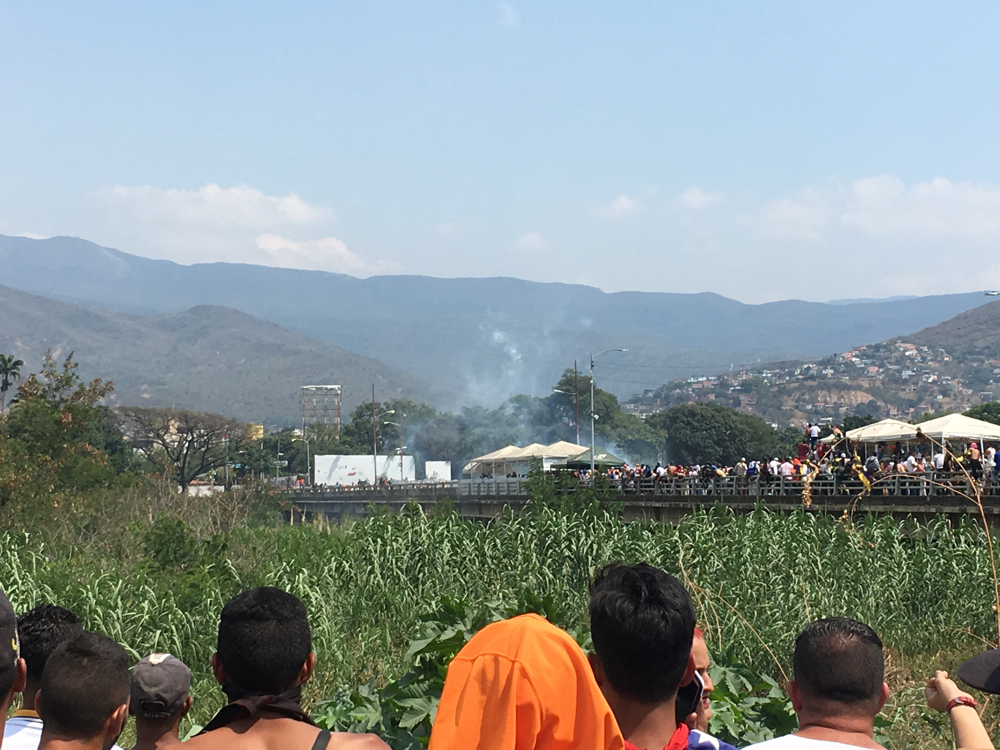
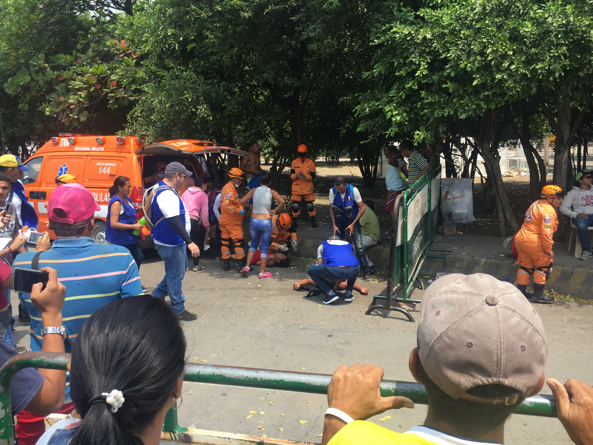

I recently returned to Cúcuta, the humid border town that is the first stop for many Venezuelans fleeing the humanitarian crisis unfolding back home. This post looks at how the situation compares to my first visit almost a year earlier, as well as my experience at the Venezuela Aid Live Concert and the war-like scenes the following day.‍

As soon as I arrived in Bogotá in February 2018 it became apparent there was a crisis brewing over the border. Bogotá has long been a city where every day you see people living on the street and asking for money or 'una colaboración'. But when I arrived in that February I was struck by the number of families living on the street, looking lost and bewildered. There were no hallmarks of drug use or the imprinted dirt and soot that is unavoidable in life on Bogotá's pavements. This was new. These were families that had recently found themselves without money or homes.‍

It's a scene I have become all too familiar with and each day you feel the desperation of these people incrementally deepen. They have left their country, Venezuela, in search of a substitute they hope will be able to sustain them a little longer. For many, there was no choice in the matter. They either stayed and died of hunger or illness, or packed as much as they could carry and walked on in hope.‍

Shortly after arriving in Bogotá, I met Dylan Baddour (check out [his Twitter](https://twitter.com/DylanBaddour/)), a Texan journalist dedicated to reporting on the worsening situation in Venezuela. He spends much of his time in Cúcuta, the humid Colombian border town where many Venezuelans enter the country. He invited me to join him on his next trip as a quasi fixer.‍

At this point, the situation was already bad but it hadn't really gathered any international attention. Aid groups were just starting to realise there was a problem and Colombia was still working out its stance for managing the increasing number of migrants entering the country. However, the situation on the ground was already desperate. Cúcuta has three 'border bridges' where Venezuelans can cross into Colombia and vice-versa. The bridges make up an effectively open border, where you can just walk across without checks. Even if you ran into any issues on the bridge, you could just hop off the side and walk alongside the bridge and over the border. The often-wooded countryside between the border bridges is completely unmanned and unregulated by the authorities so armed militias, narco-traffickers and the like willingly fill that void. The migration officers don't care what happens off the bridge, it's not in their pay bracket. Venezuelan recyclers know this and take advantage of it. When they are stopped walking across the bridge with scrap metal to sell in Colombia, they just hop off the bridge and continue their search for earnings in a more dependable currency.‍

Before talking about the situation at the border back in April 2018 and my most recent visit almost a year later, it is worth looking at why these people are leaving their country. Colombia itself has problems, especially with homelessness, poverty and unemployment. Sadly, for most Venezuelans, Colombia's problems are nothing compared to what is unfolding at home in Venezuela.‍

Venezuela is one of the worlds few remaining socialist run countries. Socialism under their previous president, Hugo Chavez, brought wealth, prosperity, health, employment and general wellbeing to Venezuela's people before being succeeded by Nicolás Maduro in 2002. With the largest known oil reserves in the world, it succeeded in abating the issues that normally plague socialist nations who inevitably need to trade with outside countries for resources that are unattainable internally (see: Cuba). Cúcuta during this period was a playground for Venezuelans who wanted to hop the border to buy cheap goods with their strong currency. Shopkeepers on Cúcuta's high-street reminisce about Venezuelans arriving and buying 12 pairs of the same latest brand-name trainers or buying 5 of the latest laptops to take back for their family. Not only were they wealthy but well looked after. The healthcare system in Venezuela was exceptional (often aided by Cuba's renowned doctors). Employment was easy to find and the government provided you with the necessities to live.‍

Socialism, however, structurally requires a concentration of power that humans are not well suited too. Be it in capitalist markets, government or office politics, the side effects of over-concentrated power falling into incapable hands always outweighs the benefits. In Venezuela, this sorry dynamic has had generational impacts. Under the management of Nicolás Maduro, both incompetence and systemic corruption have vaporised Venezuela's economic prosperity. With the majority of vital industries being centrally run, the effects of bad management and corruption have reverberated down through the fabric of Venezuelan life. Unemployment has shot up, food is barely available and when it is the prices are a multiple of the average persons' monthly salary. Inflation has been eye-watering. The inflation rate at the end of January 2019 was 2.69 million percent ([Trading Economics](https://tradingeconomics.com/venezuela/inflation-cpi)). To put that into perspective using a more familiar currency, if you had $100,000 of savings when I first visited, that level of inflation would have reduced its value to 0.0037 of a cent by the time I returned. This is why it is so juxtaposed when you see families on the street in Bogotá. No one deserves to live without housing or food, of course. But homelessness is often sewn from the threads of addiction, broken families, illness or a lack of support network. What really hits home about this crisis is that the people in the street could be your family. Doctors, engineers, teachers, lawyers, children, grandparents and so on. The poverty is indiscriminate for these Venezuelans. You could have worked hard, saved money, bought a house and been the exemplary citizen and still seen your wealth turn to ash overnight. Even though it's made of bricks and mortar, the house you own is useless if there is no food in the country. Your career and social status mean nothing if your elderly parents die because they can't eat and can't get medical treatment in the empty, medicine-free hospitals of your country. When I first visited Cúcuta there were money changers in the street with piles of money as high as their waist next to them. This time they had resorted using the cash as fabric to make novel handbags.

Not only would the economic dystopia be enough to drive you out but the administrative void left by the government is being filled by armed thugs. Venezuela is a narco-traffickers playground. Paramilitary groups have taken over swathes of land and 'collectivos' (armed pro-military groups) can do as they like as long as they help the incumbent government cling on to power.‍

So 'home' isn't great at the moment for what is normally the most patriotic nation I have met. When I arrived at Cúcuta in April 2018 I was shocked by the diversity of people arriving at the border. Old people who could barely walk. The handicapped. Heavily pregnant women who would prefer to have their babies on the streets of Colombia than risk their chances back home. A lady I spoke with at a church-lead food bank had given birth without any medical help just days before. Her tiny baby's first days being spent on humid, dirty streets with no prospect of change. That these people have opted to come here in these circumstances speaks gravely of the situation back in Venezuela.‍

Most arrive at the border with intentions of moving on further through Colombia or even on to other Latin American nations such as Ecuador, Peru and Chile. Most have to work selling sweets or begging to fund the onward journey making Cúcuta a scene of endless street sellers.‍

When I visited Cúcuta last year, the migration situation was more uncertain. Most Venezuelans have never had the need for a passport making it a fraught process to get the necessary papers to enter Colombia legally. Passports are very expensive compared to the average salary and with the government department in disarray, you either need to have a connection (and money for bribes) or wait years to receive one. Since my first visit, Colombia and many other Latin countries have started to allow passport-free travel and made it far easier to obtain papers to work. Fortunately, these Latino governments have learnt that this is their crisis as much as Venezuela's and are now doing their best to be accommodating (a little lesson in humanity that Western governments could learn from).‍

Despite all this plight, there are further nefarious forces at work. Some people I spoke to had been sold fake onward bus tickets putting them back to square one in both finances and morale. Many had been robbed by police or border guards on the way to Colombia who relieved them of anything expensive they had brought to sell once they arrived.‍

The fact that the Venezuelans continue to be such a warm, kind and positive people against this backdrop slightly restores your faltering faith in humanity. Coffee sellers laughed and joked with me whilst sat next to the money changer's waist-high piles of their effectively valueless currency.‍

Since my first visit, the situation in Venezuela has worsened markedly. It's estimated that now 2.7 million of the 32 million population have left Venezuela in search of survival ([Yahoo](https://news.yahoo.com/2-7-million-people-fled-venezuela-since-2015-154247595.html)). Each day on the Transmilenio (the public transport system) in Bogotá, the tones of desperation in the voices of those families begging for coins increases. The saturation causes indifference. Desperation causes crime. Despite the Colombians being endlessly generous - each day you see extreme acts of kindness to strangers - the strain being put on their society is being felt. Stories of thefts and crime are increasingly being recounted with Venezuelan protagonists.‍

I returned to Cúcuta in late February 2019 for Venezuela Aid Live - a music festival organised by Richard Branson aimed to raise money for the Venezuelans and increasing awareness. The festival was interwoven with some interesting and divisive developments. Firstly, the Venezuelan politician Juan Guaidó was recently recognised as the de facto president by many foreign nations. Maduro however still holds the support of the military and therefore effective control of the country meaning that Guaidó's main aim is to promote defections and disobedience in their ranks.‍

Also interestingly, the US has sent multiple shipments of aid, such as food and medicine, to supposedly help the suffering Venezuelans. This aid has become a political hot potato with many aid organisations distancing themselves from it through fear that it is a guise for US intervention. Maduro echoes these fears saying that the aid is a trojan horse for US imperialism and even said that it could contain armaments for anti-government operations. This is understandable as the US has got previous for this. The guy running the current aid operation was a key figure in the arming of anti-government forces in Guatemala in the '80s, an operation where they smuggled weapons in aid shipments.‍

Why Richard Branson was involved is beyond me. His roughly recorded festival video looked more like a hostage tape. His inability to pronounce Juan Guaidó's name (the person who supposedly invited him!) or the even the name of the town where the festival would be held made his link to the event look ceremonial.‍

In the run-up to the big day, the festival was looking like a political Fyre Festival. Festival organisers had not spoken to local governments even though they were organising a potentially 300 thousand person event in an area riddled with armed militant groups, shooting distance from a bridge blockaded by the Venezuelan national guard. What could go wrong?‍

As I arrived at the festival, I was relieved to see what seemed to be a well-organised event slowly filling up with happy and excited Venezuelans. For many, this marked a recognition of their suffering. A happy day of celebration against a backdrop of misery and a chance to highlight to the world that they needed help. Despite the unsettling foundations, the festival went ahead without hitch. However, the fragility of the situation was always present. At one point, a large group of people queuing to enter the festival suddenly turned around and ran, fleeing from some unseen disaster up ahead. Dylan and I joined and hid up a tree for safety from the stampede. After the panic had dissipated, it became apparent that it was triggered by a couple of people running normally and that everyone had seen this and assumed the worst. A happy outcome but one that highlighted the unease that everyone was feeling but not really showing.

A Venezuelan singer opened his set by telling the Venezuelans in the crowd not to be ashamed. Although they were having to do horrible, undignified jobs to survive now, they needed to keep their faith and know that the situation will get better.

If you measure success by its detractors then Branson pulled it off. Maduro, in a bid to hide how much the tide is turning against him, turned off Facebook, Google and other websites for the whole country so news of the event couldn't be shared.‍

The concert was part one of a two-part plan. The concert was going to show the world, those Venezuelans still in Venezuela and Maduro's loyal military just how many people have turned. It was designed to set the stage for part two - taking the aid into Venezuela the following day. The aid - which included enough rice to feed 2000 people for a month - was largely symbolic. Whilst it would help the populations of towns on the border for a little while, it wouldn't change much. However, to get the aid in the country, the Venezuelan military would need to go against Maduro's orders to allow it in. This would be the first step in what was - and still is - hoped to be the loosening of the control Maduro has over the only thing keeping him in power - his army.‍

I arrived at the main border bridge 'La Tienditas' at about 9 am on the Saturday morning to find a mobilising group of Venezuelans who had camped nearby the night before. The plan - implicitly backed by USAid, Juan Guaid&oacute; and the presidents of supporting Latin nations - was for the Venezuelans to arm with white roses and then create a human chain to transport aid over the border. The hope was that the Venezuelan military would have to allow them through otherwise they would be stopping vital food and medicine reaching their starving family members and patriots. Seemingly no one had made plans for how to get around the three shipping containers that had been filled with water and welded to the floor to block the bridge.

About lunchtime, Dylan, the journalist and friend who I was with, had worked out that this bridge would be the scene of a largely ceremonial march and the actual aid would be taken to a nearby bridge 'La Parada'. We left for this bridge to arrive at a scene of chaos. Thousands of Venezuelans were on the bridge being hyped up by people microphones connected to trucks of speakers. The Venezuelan army and 'collectivos' (armed pro-government groups) blocked the border. At the front of the Venezuelan line was a row of armoured police shooting tear gas and rubber bullets and behind them, the collectivos were throwing rocks and later petrol bombs. All this before the actual aid had arrived.‍

Then the buses of aid arrived with people hanging off them. It was some spectacle and one that was set to rile up an already tense situation. I messaged Dylan, who at this point was at the front of the bridge by the action, to let him know that the aid was arriving. He replied, "oh god".‍

Tear gas was being fired almost every 30 seconds which was normally shortly followed by medics carrying out people who couldn't breathe. Even though I was standing far back from the epicentre I struggled to breathe and my eyes streamed with stinging tears. With every 'bang' I heard, I made a split-second analysis to judge whether it was tear gas or an escalation to gunshots.‍

Sudden moments of chaos would ignite, with people running to get away from some not immediately identifiable danger. The vacuum of knowledge often triggering further panic. The hype men on the speaker trucks shouted at people not to run. They said that nothing could happen to you on Colombian soil, that the Venezuelan army couldn't do anything to you here. They shouted this from their comfy trucks, well hidden from any form of danger.‍

Occasionally you would hear a huge uptick in screaming and excitement followed by everyone energetically huddling around something. Everyone, myself included, ran forward to see what was the source of the excitement thus increasing the excitement and so on. It was members of the Venezuelan military defecting. The excited crowds would lift the defector's arms in celebration as they were swept away by Colombian police to be processed. Often it was difficult to tell if the crowds want to kill or kiss the defectors given moments before they crossed the line from sworn enemy to ally.‍

Later, watching the chaos unfold in a quiet spot next to the bridge, it seemed that there would be no end to this situation. The lack of any type of plan had resulted in predictable carnage and increasing violence.‍

Petrol bombs started being thrown, igniting the vegetation around the bridge. Men were carried past us with rubber bullet holes. After I left for my flight home, those on the Colombian side captured a collectivo member, beat him to a pulp and carried him to the authorities.

The standoff continued with the violence mounting. It's hard to say if the organisers achieved their plan as it's difficult to tell what that plan was. Members of Maduro's military - the thread holding him in power - did indeed defect. Those numbers are steadily growing, however, there has been little movement in the upper ranks that could indicate a loosening on his toxic grip. For now, the swelling of hope that the weekend provoked is in retreat and the daily struggle of survival for those Venezuelans goes on.